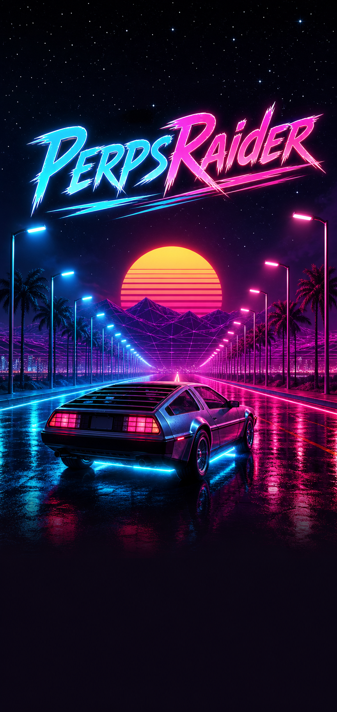
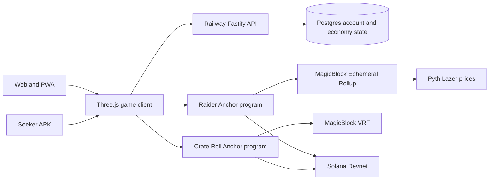

<p align="center">
  
</p>

<h1 align="center">Perps Rider</h1>

<p align="center">
  A live perpetual-futures position you drive through a synthwave arcade racer.
</p>

<p align="center">
  <a href="https://redline-web-production.up.railway.app/play/">Play on the web</a>
  ·
  <a href="https://redline-web-production.up.railway.app/downloads/perps-rider.apk">Download the Seeker APK</a>
  ·
  Solana Devnet
</p>

Perps Rider turns a leveraged BTC, ETH, or SOL position into a driving game. Direction chooses LONG or SHORT, the tachometer controls leverage, live Pyth prices move the position, and the on-chain program decides liquidation, cap, timeout, and payout on a MagicBlock Ephemeral Rollup.

The repository contains the Three.js game, Railway-backed account service, two Anchor programs, Android/Seeker packaging, deterministic economics, simulations, and verification evidence.

## Quickstart

Requirements: Node.js 22+, npm, Git, and `dwebp` from libwebp. `dwebp` is mandatory for the default asset-validation test suite. The basic local loop uses in-memory PGlite, so Postgres is optional.

Install libwebp on macOS with Homebrew:

```bash
brew install webp
```

For Linux, Windows, and other platforms, use the [official libwebp releases and installation documentation](https://developers.google.com/speed/webp/download). Verify the decoder is available on `PATH`:

```bash
dwebp -version
```

```bash
git clone https://github.com/EchoWebLV/perps-games.git
cd perps-games
npm ci
npm ci --prefix redline3d
```

Start the API:

```bash
npm run dev --workspace @perps/server
```

In another terminal, start the game:

```bash
npm run dev --prefix redline3d -- --host 0.0.0.0
```

Open the Vite URL shown in the terminal. Guest practice works without credentials. Signed-in wallet and Devnet flows require the Vite variables used by `redline3d/.env` or your own ignored local environment file.

## Architecture



- Money and round settlement live in program-owned Solana accounts.
- Fast round execution and continuous settlement run on the MagicBlock Ephemeral Rollup.
- BTC, ETH, and SOL marks come from authenticated Pyth Lazer feeds.
- Crate randomness is requested through the MagicBlock VRF consumer program.
- Coins, scrap, cars, identity, and cross-device sync are maintained by the account API.

## Repository map

| Path | Purpose |
| --- | --- |
| `redline3d/` | Three.js game, landing page, PWA, Vitest suite, and Capacitor Android app |
| `server/` | Fastify account, economy, payment, and multiplayer presence API |
| `packages/engine/` | Shared deterministic leverage, settlement, and entitlement math |
| `onchain/raider/` | Anchor workspace for the Raider and Crate Roll programs |
| `sim/` | House-economics and high-leverage market simulations |
| `docs/` | Product designs, implementation plans, research, and submission material |
| `journey/`, `prototype/`, `spikes/` | Historical visual exploration and technical probes |

## Development

### Game client

```bash
npm test --prefix redline3d
npm run build --prefix redline3d
```

### API and shared engine

```bash
npm test --workspace @perps/engine
npm run build --workspace @perps/engine
npm test --workspace @perps/server
npm run build --workspace @perps/server
```

Local development can use in-memory PGlite. Durable local data uses Postgres as described in [`server/README.md`](server/README.md).

### Anchor programs

The workspace pins Anchor 0.32.1 and Solana Devnet in `onchain/raider/Anchor.toml`.

```bash
cd onchain/raider
npm ci
cargo test -p raider
anchor build
```

Devnet integration drivers spend Devnet SOL and require the configured wallet and RPC. They are intentionally separate from the default unit-test loop.

### Seeker and Android

Capacitor 8 requires JDK 21 and the Android SDK. Native builds also require `VITE_PRIVY_APP_ID` and `VITE_BASE_RPC`.

```bash
cd redline3d
npm run apk
npm run apk:serve
npm run apk:install
```

See [`redline3d/BUILD_APK.md`](redline3d/BUILD_APK.md) for toolchain setup and sideloading instructions.

## Deployed programs

Both project programs are deployed on Solana Devnet.

| Program | Address | Explorer |
| --- | --- | --- |
| Raider game and settlement | `FwUNcUaRbYGiWasHa6DA3xQaQJfZWCgH7UhDeBvoJcBv` | https://explorer.solana.com/address/FwUNcUaRbYGiWasHa6DA3xQaQJfZWCgH7UhDeBvoJcBv?cluster=devnet |
| Crate Roll VRF consumer | `9MLzyBc2Nz4sqcnPnCsejMRGGnKMi9nepU3fSE1ZJUgG` | https://explorer.solana.com/address/9MLzyBc2Nz4sqcnPnCsejMRGGnKMi9nepU3fSE1ZJUgG?cluster=devnet |

MagicBlock dependencies used by the project:

| Dependency | Program address |
| --- | --- |
| Delegation Program | `DELeGGvXpWV2fqJUhqcF5ZSYMS4JTLjteaAMARRSaeSh` |
| Task Scheduler | `Magic11111111111111111111111111111111111111` |
| VRF Program | `Vrf1RNUjXmQGjmQrQLvJHs9SNkvDJEsRVFPkfSQUwGz` |

## What is verified

The repository includes Devnet evidence for account delegation, authenticated price reads, deterministic integer settlement, solvency locking, value conservation, owner-only withdrawal, permissionless liveness, and continuous settlement.

- [`onchain/raider/RESULT.md`](onchain/raider/RESULT.md): on-chain test results and transaction evidence
- [`docs/superpowers/submission/2026-07-hackathon-submission-draft.md`](docs/superpowers/submission/2026-07-hackathon-submission-draft.md): product and MagicBlock submission narrative
- [`sim/README.md`](sim/README.md): house-economics simulation methodology

## Current scope

This repository is a Solana Devnet hackathon build. Devnet tokens have no monetary value. The APK is a sideloadable debug build, not a Solana dApp Store release. The system should not be treated as audited or production-ready financial software.
