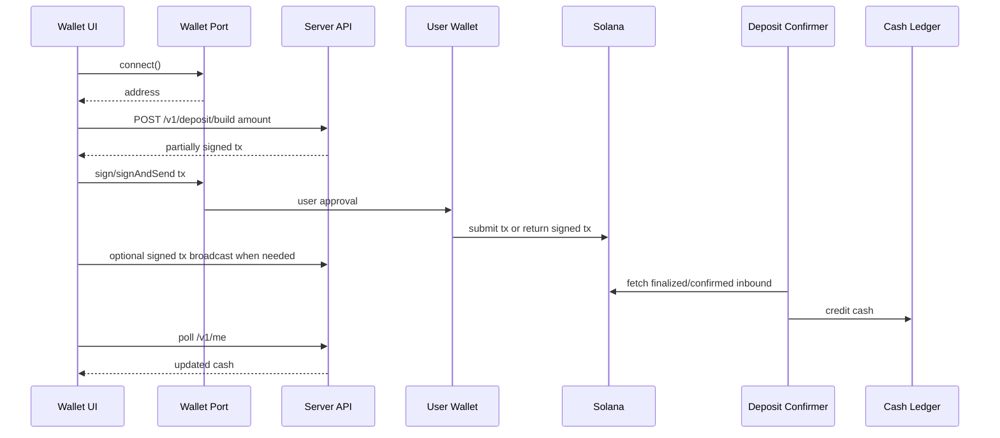
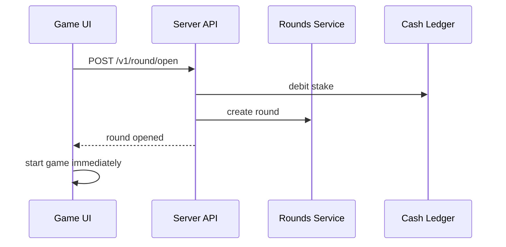

# Privy Removal + Solana Wallet Adapter Design

**Status:** Design for review.
**Date:** 2026-06-25
**Goal:** Remove Privy completely from the game client and payment path while preserving instant playability on both web and Solana Seeker.

## Decision

The game should not depend on an embedded wallet provider. Gameplay uses a server cash ledger. Wallets are only funding and withdrawal transports.

The shared product flow is:

1. User opens the app and can reach the game without loading wallet SDKs.
2. User signs in or continues as a lightweight game account.
3. User opens the wallet screen only when they want to fund or withdraw.
4. Wallet screen connects through a target-specific Solana wallet transport.
5. User deposits USDC once into the treasury.
6. Server credits `cash` after confirmed/finalized deposit reconciliation.
7. `GO!` debits server `cash` and opens the round immediately. It never opens a wallet modal and never waits for chain.

This keeps the same architecture for web and Seeker. Only the wallet transport differs.

## Targets

### Web

Use Solana Wallet Standard / Solana Wallet Adapter to connect Phantom, Solflare, Backpack, and other standard wallets.

The web wallet code must be dynamically imported from the wallet screen. It must not be part of first render, boot auth, lobby, race controls, or `GO!`.

### Solana Seeker

Use Solana Mobile Wallet Adapter (MWA) as the primary Seeker transport. It should connect to Seed Vault Wallet and any installed MWA-compatible Solana wallet.

For native Android/Capacitor packaging, the MWA implementation should be isolated behind the same wallet port used by web. Seeker-specific device detection can choose MWA first, then fall back to web wallet standard when appropriate.

## Non-Goals

- Do not replace Privy with another embedded wallet provider in the core app shell.
- Do not run onchain payment or wallet authorization during `GO!`.
- Do not require users to hold SOL only to deposit USDC.
- Do not rewrite the round engine, ledger, or settlement model.
- Do not expose treasury signing authority to the browser.

## UX Contract

### First Open

The app should feel like a game first. The player can load the 3D scene, menus, car picker, and lobby without wallet SDK weight or wallet modal behavior.

If real-money mode requires funding before a round, pressing `GO!` with insufficient `cash` opens the wallet screen with a clear funding prompt. It does not attempt payment.

### Add To Play Balance

The wallet screen owns all wallet interaction:

1. Connect wallet.
2. Show detected wallet address and wallet USDC balance.
3. User taps `Add to play balance`.
4. App builds a server-authored user-USDC-ATA to treasury-USDC-ATA transfer.
5. Server pre-signs the fee payer slot when sponsorship is enabled.
6. User wallet signs as token-account authority.
7. App submits the transaction.
8. UI shows a pending funding state.
9. Deposit confirmer credits server `cash`.
10. Future `GO!` presses are instant.

### GO

`GO!` should do only:

1. Self-heal any stale local/server round state.
2. Check server `cash >= playAmount`.
3. Open the round.
4. Start local gameplay.

No wallet SDK import, connect call, signature request, deposit build, broadcast, or chain polling is allowed in the launch handler.

## Architecture

### Wallet Port

Create a client-side wallet abstraction:

```ts
export interface SolanaWalletPort {
  kind: "web-standard" | "mobile-wallet-adapter";
  connect(): Promise<{ address: string }>;
  disconnect(): Promise<void>;
  currentAddress(): string | null;
  signTransaction(txBase64: string): Promise<string>;
  signAndSendTransaction?(txBase64: string): Promise<string>;
}
```

The wallet UI depends only on this port. It must not import Phantom, MWA, Wallet Adapter, or any provider SDK directly.

### Web Adapter

The web implementation wraps Wallet Standard / Solana Wallet Adapter behavior. It should support installed wallets and wallet selection without forcing a heavy modal into app boot.

### Seeker Adapter

The Seeker implementation wraps Mobile Wallet Adapter. It should use the same port methods but may internally use MWA transact sessions and `signAndSendTransactions` when supported.

If a wallet does not support `signAndSendTransactions`, the app can request `signTransactions` and broadcast through the server RPC endpoint. The server must still validate the transaction shape before accepting a signed transaction for broadcast.

### Wallet Transport Loader

Add a small loader:

```ts
export async function loadSolanaWalletPort(target: "auto" | "web" | "seeker"): Promise<SolanaWalletPort>
```

`auto` chooses:

1. MWA on Seeker/native Android when available.
2. Wallet Standard on web.

The loader is called only by wallet UI actions.

## Server-Sponsored Deposit Fee

Deposits should avoid requiring user SOL.

The server builds the full USDC transfer transaction:

- source: user's USDC ATA
- authority: user's wallet
- destination: treasury USDC ATA
- fee payer: server fee-payer wallet
- amount: exact cents converted to USDC base units
- mint: configured USDC mint
- token program: legacy SPL Token unless explicitly changed by a future spec

The server signs only the fee-payer slot. The user wallet signs only the authority slot. This lets the app pay network fees without gaining authority over user funds.

The existing `depositTxBuilder` already supports this shape when `TREASURY_WALLET_ID`, `TREASURY_OWNER_PUBKEY`, and the signing function are configured. The migration should keep that design but remove Privy as the fee-payer signer. The replacement can be:

- a small server-side fee-payer key stored in KMS or platform secrets for the initial version, or
- a dedicated signing service for production hardening.

The fee-payer must be a hot wallet with a low SOL balance and monitoring. It must never be the treasury token authority unless a later security review explicitly approves that.

## Auth And Accounts

Privy currently supplies both auth and wallet identity. Removing Privy requires separating game accounts from wallet ownership.

Use a lightweight game account:

- anonymous local account for immediate play, or
- email/passkey/social auth from a non-wallet auth provider, or
- wallet-signature auth through the connected Solana wallet.

For the first migration, prefer anonymous local account plus optional wallet binding because it best supports instant first open. The server already has a dev-style stable user seam; production should replace it with signed session tokens, not a raw `x-dev-user` header.

Wallet binding rule:

- a server user may bind one funding wallet set-once,
- a wallet may fund only one user,
- rebind attempts are ignored and alerted,
- withdrawals go only to a confirmed deposit source.

This matches the existing set-once wallet and deposit source model.

## Data Flow

### Funding



### Gameplay



## Error Handling

Wallet UI should distinguish:

- no wallet installed,
- wallet connect rejected,
- wrong network/cluster,
- no USDC,
- deposit amount below minimum,
- fee sponsorship unavailable,
- user rejected signature,
- transaction submitted but not credited yet,
- transaction failed onchain,
- server/RPC unavailable.

`GO!` should distinguish only:

- not enough play balance,
- previous round still settling,
- feed halted,
- server unavailable.

`GO!` must never show wallet approval or chain failure copy.

## Cleanup Scope

Remove from frontend:

- `@privy-io/react-auth`
- React Privy island
- Privy auth provider
- Privy-specific wallet snapshots
- Privy-specific signing methods
- any copy that says "Privy wallet"

Remove or isolate from server:

- `@privy-io/node`
- Privy auth verification
- Privy user wallet lookup
- Privy play signer
- Privy treasury signer
- old `/v1/play/payment/*` direct-pay endpoints, unless kept temporarily behind a legacy flag

Keep:

- `depositTxBuilder`
- deposit confirmer
- wallet balance reader
- ledger asset seam
- withdrawal safety model
- instant round open on server `cash`

## Testing

Client unit tests:

- `GO!` with insufficient `cash` opens wallet and does not call deposit APIs.
- `GO!` with enough `cash` calls only `openRound`.
- wallet UI calls the wallet port only from wallet actions.
- wallet transport loader chooses MWA for Seeker and Wallet Standard for web.
- no Privy imports remain in client source.

Server unit tests:

- deposit build can use non-Privy fee-payer signing.
- signed deposit broadcast path rejects malformed or message-mutated transactions.
- deposit confirmer credits once and only from the bound wallet.
- old play-payment endpoints are removed or return disabled when the legacy flag is off.
- no Privy imports remain in server source after final removal.

End-to-end tests:

- web wallet deposit then instant `GO!`.
- Seeker/MWA deposit then instant `GO!`.
- no-SOL user can deposit USDC with app-sponsored fees.
- rejected deposit approval does not affect game state.
- pending deposit survives reload and credits later.

## Migration Plan Outline

1. Add `SolanaWalletPort` and a fake test implementation.
2. Refactor wallet UI to depend on the port, not Privy auth.
3. Add web Wallet Standard adapter behind dynamic import.
4. Add Seeker/MWA adapter behind dynamic import.
5. Replace Privy auth with game-session auth.
6. Replace Privy fee-payer signing with a dedicated server fee-payer signer.
7. Remove frontend Privy package and island.
8. Remove server Privy auth and direct play-payment endpoints.
9. Run full tests and builds.
10. Verify on desktop web and Seeker device/emulator.

## Implementation Defaults

Use these defaults for the first implementation plan:

1. Game account auth starts as an anonymous signed session. Email/passkey and wallet-signed login are future account-upgrade options.
2. Fee-payer signer storage starts as an environment secret with a low-balance hot fee-payer wallet. KMS/signing-service hardening follows after web and Seeker funding are verified.
3. Deposit crediting keeps `finalized` for the ledger. The UI may show a pending state before finality, but playable `cash` is credited only by the confirmer.
4. Old `/v1/play/payment/*` endpoints are deleted in this migration unless a compile or deployment dependency proves they need a one-release disabled shim.

## Recommendation

Proceed with a two-phase migration.

Phase 1 removes Privy from the client path and makes `GO!` purely ledger-based with web wallet funding. Phase 2 adds the Seeker MWA transport and production-hardens fee sponsorship.

This gives immediate UI relief without blocking on Seeker device verification, while preserving the final architecture for both targets.
